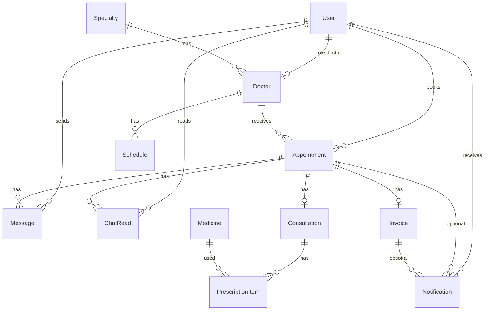

# Product Requirements Document (PRD)

## MediFlow — Realtime Hospital Management System

| Field | Value |
| --- | --- |
| Product | MediFlow |
| Versi | 1.4 — selaras implementasi (chat tanpa H+1, widget chatbot, Snap token baru tiap bayar) |
| Tipe | Group project / capstone fullstack berwaktu pendek |
| Rumah sakit | Satu RS fiktif: **RS MediFlow** |
| Core demo | Antrean realtime **dan** chat dokter–pasien (Socket.IO) |
| Role | Patient, Doctor, Admin |
| Data | Dummy + seeder, bukan data pasien sungguhan |
| Bahasa UI | Indonesia |
| Tim | **Wira** (Frontend), **Raihan** (Backend 1), **Salsa** (Backend 2) |
| Pembagian | Lihat `PEMBAGIAN-TUGAS.md` |

**Stack wajib**

- Frontend: React.js, Vite, React Router, Redux Toolkit, Axios, Tailwind CSS, Socket.IO Client
- Backend: Node.js, Express.js, Sequelize, PostgreSQL, JWT, bcrypt, Socket.IO, dotenv
- Tambahan: Google Generative AI (Gemini, backend only) dengan cadangan Groq, Midtrans Snap sandbox, Google Sign-In (pasien), ImageKit (foto admin)

**1.4 vs 1.3 (keputusan produk)**

- Chat dokter **writable setelah `completed`**, tanpa batas H+1. Thread **baca saja** sebelum konsul selesai serta pada `cancelled` / `no_show`.
- Chatbot AI = **widget** “Konsultasi awal” (bukan halaman `/chatbot`). Tamu melihat CTA login; hanya pasien yang boleh `POST /chatbot/recommend`.
- Landing (`/`) untuk tamu. User yang sudah login diarahkan ke dashboard role-nya.
- Setiap `POST /invoices/:id/pay` **membuat order Midtrans baru** (order ID + Snap token baru). Token pending **tidak** di-reuse — menghindari QRIS error 2603.
- Login Google pasien, `PATCH /me`, notifikasi in-app, Groq cadangan chatbot, dan upload ImageKit termasuk in-scope.

**Arsitektur**

- REST API untuk CRUD dan data persistence (termasuk kirim pesan chat)
- Socket.IO untuk antrean live, pesan baru, typing, dan sudah dibaca
- Backend pola MVC
- Auth JWT + role middleware (token ber-expiry; `SECRET_KEY` wajib di production)
- Socket.IO diautentikasi dengan JWT
- Satu instance Socket.IO server (jangan dua server terpisah)

---

## 1. Product Vision

**MediFlow** membantu pasien RS MediFlow membuat janji ke sesi praktek dokter, mendapat nomor antrean, dan melihat giliran mereka berubah **tanpa refresh halaman**. Setelah dipanggil, dokter menyelesaikan konsultasi, meresepkan obat, dan sistem membuat tagihan yang dibayar pasien via Midtrans. **Setelah konsultasi selesai**, pasien dan dokter **chat teks** di thread appointment itu (ketik, pesan muncul live, sudah dibaca) tanpa batas H+1.

### Masalah

Pasien tidak tahu kapan dipanggil; staf/dokter masih memanggil manual; booking tidak terikat kuota sesi; setelah konsul, resep dan tagihan terpisah-pisah; pasien tidak bisa bertanya ke dokter soal resep setelah pulang.

Untuk capstone, yang **harus terlihat terpecahkan di demo**:

1. Antrean live (Panggil tanpa refresh)
2. Chat live di thread appointment **setelah konsul selesai** (pesan, typing, sudah dibaca)

### Tujuan

Satu alur kunjungan yang utuh: cari dokter → booking sesi → antrean live → konsul → resep + tagihan → bayar sandbox → **baru kemudian** chat dengan dokter.

### Bukan untuk

Bukan HIS/EMR production, bukan marketplace lintas RS, bukan alat medis, bukan aplikasi video call / telemedicine.

### Success demo

1. Dua browser (pasien + dokter): dokter tekan **Panggil**, nomor di layar pasien berubah tanpa refresh.
2. Pasien kirim pesan di thread appointment; dokter melihat pesan, indikator mengetik, dan centang sudah dibaca — tanpa refresh.
3. Chatbot hanya merekomendasikan dokter yang jadwalnya memang tersedia. Setelah resep, tagihan muncul dan status Midtrans sandbox bisa jadi `paid`.

---

## 2. Goals dan Non-Goals

### Goals MVP

- Auth pasien (register/login email, **login Google**); Doctor & Admin via seeder; profil `PATCH /me`
- Direktori publik: spesialisasi dan dokter
- Chatbot AI (widget, login pasien) merekomendasikan spesialis + dokter berjadwal (Gemini, cadangan Groq)
- Booking sesi pagi/siang dengan kuota dan nomor antrean
- Antrean realtime (core) + notifikasi in-app (dipanggil, skip, tagihan)
- **Chat teks dokter–pasien per appointment setelah `completed`**, plus typing dan sudah dibaca
- Konsultasi ringan + resep dari katalog + invoice
- Bayar Midtrans Snap sandbox (token baru tiap percobaan bayar)
- Admin CRUD spesialisasi, dokter, jadwal, obat (foto via ImageKit); lihat appointment & pembayaran

### Non-goals (out of scope)

Walk-in, IGD, lab, rawat inap, BPJS, stok apotek, email/SMS/WhatsApp, verifikasi email, **upload file/foto di chat**, rating, TV ruang tunggu (kecuali sisa waktu), **video/voice call (telemedicine)**, chat grup, chat dengan admin, hapus/edit pesan, search riwayat chat, multi-RS, role extra (perawat/resepsionis/apoteker/kasir), Google Maps, refund, diagnosa otomatis AI.

Chat dokter **bukan** chatbot Gemini. Chatbot = rekomendasi sebelum booking. Chat dokter = manusia, setelah ada appointment.

---

## 3. Persona dan Role

| Role | Siapa | Akses utama |
| --- | --- | --- |
| **Patient** | Pengunjung RS yang berobat jalan | Cari, chatbot AI, booking, chat dokter, pantau antrean, lihat resep/tagihan milik sendiri, bayar |
| **Doctor** | Dokter praktek di RS MediFlow | Inbox chat, buka sesi, panggil antrean, konsul, resep, generate tagihan untuk pasien di sesinya |
| **Admin** | Staf tata kelola data RS | CRUD master data, lihat appointment & pembayaran, dashboard hitungan. **Tidak** ikut chat |

Register hanya **Patient**. Doctor dan Admin **tidak self-register**.

### Permission matrix

| Resource | Patient | Doctor | Admin |
| --- | --- | --- | --- |
| Register / profil sendiri | CRUD profil sendiri | Baca profil sendiri | Baca semua user (pasien terbatas) |
| Specialty | Baca (publik) | Baca | CRUD |
| Doctor profil | Baca (publik) | Baca milik sendiri | CRUD |
| Schedule | Baca jadwal tersedia | Baca milik sendiri | CRUD |
| Appointment | CRUD milik sendiri (create/cancel sesuai aturan) | Baca/ubah status milik sesinya | Baca semua |
| Queue (live) | Join room sesi yang dia booking | Join & aksi panggil/skip pada sesinya | Baca opsional |
| Chat thread | Kirim/baca thread appointment sendiri | Kirim/baca thread appointment miliknya | — |
| Consultation / resep | Baca milik sendiri | CRUD untuk appointment sesinya | Baca |
| Medicine katalog | — | Baca | CRUD |
| Invoice / Midtrans | Baca + bayar milik sendiri | Baca milik pasien sesinya | Baca semua |
| Chatbot AI | Pakai | — | — |
| Notifikasi | Baca milik sendiri | Baca milik sendiri | — |
| Dashboard statistik | — | Antrean sesinya + unread chat | Booking hari ini, antrean aktif |

**Data medis:** pasien hanya data sendiri; dokter hanya pasien di appointment-nya; admin tidak membaca isi chat dan tidak perlu isi diagnosa di dashboard.

---

## 4. User Journey End-to-End

### Happy path pasien

1. Buka landing RS MediFlow (**tamu**). User yang sudah login tidak melihat landing; diarahkan ke dashboard role.
2. Pilih **Layanan** (poli / dokter) atau buka widget **Konsultasi awal**. Chatbot minta login pasien.
3. Lihat dokter + sesi yang masih ada kuota.
4. Register/login (email atau Google) jika belum. Akun Google tanpa HP dilengkapi di `/akun`.
5. Pilih tanggal + sesi (pagi/siang) → booking berhasil → dapat **nomor antrean**.
6. Status `booked`. Hari-H, dokter buka sesi → status antrian `waiting`.
7. Pasien pantau antrean: nomor saya, yang sedang dipanggil, sisa di depan — live. **Tidak ada kirim chat selama pemeriksaan.**
8. Dokter **Panggil** → `called` → masuk ruang → `in_consultation`.
9. Dokter isi keluhan/diagnosa/catatan + item resep → selesai → invoice `unpaid`.
10. **Setelah konsultasi selesai**, pasien dan dokter boleh chat teks **tanpa batas H+1**. Thread tetap **baca saja** pada `cancelled` / `no_show`.
11. Pasien buka tagihan → **Bayar** Snap sandbox (setiap klik mint token baru) → webhook atau GET sync → `paid`. Jika QRIS gagal (kode 2603), pilih Transfer Bank di Snap.

### Journey dokter

Login (akun seed) → dashboard sesi hari ini → **Buka sesi** → daftar antrean urut nomor → **Panggil** / **Lewati (no-show)** → **Mulai konsul** → form + resep → **Selesai konsul** (invoice terbuat) → **baru kemudian** chat dengan pasien.

### Journey admin

Login seed → dashboard angka hari ini → CRUD spesialisasi/dokter/jadwal/obat → monitor appointment & status bayar. Tidak ada inbox chat.

```mermaid
flowchart LR
  landing[Landing tamu] --> search[Cari spesialis atau dokter]
  landing --> bot[Widget chatbot]
  bot --> rec[Rekomendasi dokter]
  search --> book[Booking sesi]
  rec --> book
  book --> queue[Antrean live]
  queue --> call[Dokter panggil]
  call --> consult[Konsultasi]
  consult --> rx[Resep plus tagihan]
  rx --> pay[Bayar Midtrans]
  consult --> docChat[Chat dokter]
```

---

## 5. Information Architecture / Halaman

### Publik

| Halaman | Tujuan | Data | Aksi | Empty state |
| --- | --- | --- | --- | --- |
| Landing `/` | Masuk produk (tamu) | Poli, dokter unggulan, kontak | Navigasi ke Layanan / login | — |
| Layanan `/layanan` | Direktori poli + dokter | Nama, filter, kuota, `imgUrl` | Buka detail | Belum ada spesialisasi / dokter |
| Detail spesialisasi | Pilih tanggal & sesi | Kalender 14 hari, sesi pagi/siang, dokter, sisa kuota | Pesan sesi (login pasien) | Tidak ada jadwal |
| Detail dokter | Pilih dokter | Nama, spesialisasi, biaya, bio, jadwal sesi + sisa kuota | Pilih sesi (login untuk book) | Tidak ada jadwal |
| Login / Register | Auth pasien | Form email + **Google Sign-In** | Submit | Validasi error |

Rute `/chatbot` di-redirect ke `/`. Chatbot = widget mengambang, disembunyikan di `/pesan` dan untuk role dokter/admin.

### Patient (login)

| Halaman | Tujuan | Aksi utama |
| --- | --- | --- |
| Widget Konsultasi awal | Rekomendasi dokter | Kirim keluhan, buka booking dari kartu rekomendasi |
| Booking konfirmasi | Kunci sesi | Konfirmasi; gagal jika kuota penuh |
| Dashboard `/saya` | Appointment, nomor antrean, status, badge unread | Buka antrean, buka chat (setelah completed), cancel jika masih boleh |
| Inbox `/pesan` | Daftar thread | Buka thread |
| Thread chat | Bicara dengan dokter appointment itu | Kirim teks setelah `completed`; lihat typing & sudah dibaca |
| Antrean live | Pantau giliran | Tidak perlu refresh |
| Tagihan `/tagihan` | Resep + rincian + bayar | Bayar Midtrans Snap |
| Akun `/akun` | Profil | Ubah nama, HP, password |

### Doctor

| Halaman | Tujuan | Aksi utama |
| --- | --- | --- |
| Inbox chat | Daftar thread + unread | Buka thread |
| Sesi hari ini `/dokter` | Pilih sesi pagi/siang | Buka sesi |
| Board antrean | Panggil pasien | Panggil, Lewati, Mulai konsul |
| Thread chat | Balas pasien | Kirim teks setelah `completed`; typing; sudah dibaca |
| Form konsultasi | Selesai tindakan | Diagnosa, resep katalog, submit tagihan |
| Akun `/akun` | Profil | Ubah nama, HP, password |

### Admin

| Halaman | Tujuan | Aksi utama |
| --- | --- | --- |
| Dashboard | Hitungan hari ini | Lihat angka |
| Spesialisasi / Dokter / Jadwal / Obat | Master data | CRUD |
| Appointment | Monitor | Filter status |
| Pembayaran | Monitor invoice | Filter status |

Komponen wajib: `ChatThread` dipakai patient dan doctor. Widget chatbot **bukan** `ChatThread`. Tidak ada chat dokter di landing. Tidak ada chat dengan admin. Bel notifikasi di Navbar untuk pasien dan dokter.

---

## 6. Fitur MVP

### A. Auth — FR-AUTH

Register pasien (nama, email, password, no. HP). Login JWT (expiry default 7 hari, override `JWT_EXPIRES_IN`). **Login Google** untuk pasien (`POST /auth/google`, `idToken`); dokter/admin seed tidak dibuat lewat Google. `GET` / `PATCH /me` (nama, HP, password opsional). Logout. Proteksi route frontend + middleware backend. Production tanpa `SECRET_KEY` ditolak.

### B. Direktori — FR-DIR

Baca publik spesialisasi & dokter. Filter nama dokter dan spesialisasi. Tampilkan sesi + sisa kuota. Kartu poli dan dokter memakai `imgUrl` yang sesuai objeknya. Tidak ada cari RS / maps / rating.

### C. Chatbot AI — FR-BOT

Patient login. Gemini di backend, **Groq sebagai cadangan** jika Gemini tidak dikonfigurasi atau gagal. Rekomendasi 1 spesialis + 1–3 dokter berjadwal + CTA booking. Disclaimer. Bukan diagnosa/obat/IGD. **Bukan** pengganti chat dokter. UI: widget mengambang “Konsultasi awal”, bukan halaman khusus.

### D. Appointment & kuota — FR-APT

Booking tanggal + `morning`/`afternoon`. Nomor antrean = urutan booking. Tolak kuota penuh, tanggal lampau, tidak ada jadwal, double-book dokter yang sama pada tanggal+sesi yang sama. Cancel hanya sebelum `called`. Satu appointment = satu thread chat (GET riwayat boleh untuk peserta); **kirim pesan baru setelah `completed`**.

### E. Antrean realtime (CORE) — FR-Q

Room `doctorId + date + session`. Event: `queue:updated`, `queue:called`, `queue:completed`. Hydrate via REST, live via socket. Notifikasi in-app `queue_called` / `queue_skipped` / `session_opened` ke pasien.

### F. Chat dokter–pasien — FR-CHAT

Satu thread per appointment. Teks saja, max ~1000 karakter. Typing tidak dipersist. Sudah dibaca via `ChatRead.lastReadAt` dan `lastReadMessageId`. **Writable hanya setelah status `completed`**, tanpa batas H+1. Read-only pada `booked`/`waiting`/`called`/`in_consultation` serta `cancelled`/`no_show`.

### G. Konsul, resep, tagihan — FR-RX

Form ringan. Katalog obat dengan foto. Tagihan = `consultationFee + sum(obat.price * qty)`. Satu invoice per appointment, status awal `unpaid`. Chat tidak menggantikan form konsul.

### H. Midtrans — FR-PAY

Snap sandbox. Token dari backend. Setiap `POST /invoices/:id/pay` (selama belum `paid`): batalkan order lama jika ada, buat **order ID baru** `MEDIFLOW-{invoiceId}-{timestamp}` dan Snap token baru. Payload: `gross_amount` integer, `item_details` yang jumlahnya sama dengan amount, `customer_details` bila ada. Status `unpaid → pending → paid|expire|failed`. Tolak bayar ulang jika `paid`. Webhook wajib verifikasi signature **dan** `gross_amount` sesuai `invoice.amount` (mismatch diabaikan). **GET invoice / list** ikut sync status dari Midtrans Core API (cadangan jika webhook tidak sampai ke localhost). Jika QRIS/GoPay gagal memproses QR (error 2603), pasien memakai metode lain di Snap (Transfer Bank).

### I. Admin CMS — FR-ADM

CRUD spesialisasi (nama, deskripsi, foto poli), dokter (user role doctor + fee + bio + foto), jadwal, obat (nama, harga, foto). Upload foto via ImageKit (`POST /admin/uploads`). Lihat appointment & invoice. Dashboard: booking hari ini, antrean aktif. Bukan laporan keuangan. Admin **tidak** memoderasi chat.

### J. Notifikasi — FR-NOTIF

Pasien dan dokter: `GET /notifications`, tandai dibaca, event socket `notification:new` ke room user. Jenis: booking, sesi dibuka, dipanggil, dilewati, tagihan dibuat/berubah status. Admin tidak memakai bel.

---

## 7. User Stories + Acceptance Criteria

**US-01** Sebagai pengunjung, saya ingin melihat daftar spesialisasi tanpa login, agar saya tahu poli apa yang ada.

- AC: halaman publik 200; tanpa token; empty state jika kosong; kartu poli menampilkan `imgUrl` bila ada.

**US-02** Sebagai pengunjung, saya ingin mencari dokter berdasarkan nama atau spesialisasi, agar saya tidak harus sudah kenal dokternya.

- AC: filter bekerja; kartu dokter menampilkan spesialisasi, biaya, sesi dengan sisa kuota.

**US-03** Sebagai pasien, saya ingin register dengan email unik, agar saya punya akun.

- AC: email duplikat 409; password di-hash bcrypt; response tanpa password.

**US-04** Sebagai user, saya ingin login JWT sesuai role, agar saya masuk dashboard yang benar.

- AC: kredensial salah 401; patient/doctor/admin diarahkan benar; token dipakai di REST dan socket; JWT punya `exp` (default 7 hari).

**US-04b** Sebagai pasien, saya ingin masuk dengan Google, agar tidak perlu password baru.

- AC: `POST /auth/google` dengan `idToken` valid; akun pasien baru dibuat bila email belum ada; dokter/admin yang email-nya sudah seed tidak diubah rolenya; HP boleh dilengkapi nanti di `/akun`.

**US-05** Sebagai pasien, saya ingin chat dengan asisten AI, agar saya dapat rekomendasi dokter.

- AC: tanpa login 401; disclaimer terlihat di widget; jawaban berisi dokter yang ada di DB.

**US-06** Sebagai pasien, saya ingin rekomendasi hanya untuk dokter yang sesinya masih ada kuota, agar saya bisa langsung booking.

- AC: dokter kuota 0 tidak direkomendasikan; jika tidak ada yang cocok, pesan jujur + tautan daftar spesialisasi.

**US-07** Sebagai pasien, saya ingin booking sesi pagi/siang, agar saya dapat nomor antrean.

- AC: sukses → nomor urut; kuota berkurang; status `booked`; GET thread boleh (POST pesan 409 sampai `completed`).

**US-08** Sebagai pasien, saya tidak ingin booking jika kuota penuh.

- AC: 409; nomor tidak terbit; kuota tidak berubah.

**US-09** Sebagai pasien, saya tidak ingin double-book dokter yang sama di tanggal+sesi yang sama.

- AC: 409.

**US-10** Sebagai pasien, saya tidak ingin booking tanggal lampau.

- AC: 400.

**US-11** Sebagai pasien, saya ingin membatalkan janji sebelum dipanggil.

- AC: `booked`/`waiting` → `cancelled`; setelah `called` cancel ditolak; chat menjadi read-only.

**US-12** Sebagai dokter, saya ingin membuka sesi hari ini, agar pasien masuk status waiting.

- AC: appointment `booked` sesi itu → `waiting`; emit `queue:updated`.

**US-13** Sebagai dokter, saya ingin menekan Panggil, agar pasien berikutnya dipanggil live.

- AC: status `called`; event `queue:called`; browser pasien berubah tanpa refresh.

**US-14** Sebagai dokter, saya tidak ingin Panggil saat antrean kosong.

- AC: 409; tidak ada event called palsu.

**US-15** Sebagai dokter, saya ingin melewati pasien yang tidak datang.

- AC: `no_show`; pasien berikutnya bisa dipanggil; emit `queue:updated`; chat thread itu read-only.

**US-16** Sebagai pasien, saya ingin melihat nomor saya, nomor dipanggil, dan sisa di depan.

- AC: benar setelah hydrate dan setelah event socket; reconnect mengembalikan angka yang sama.

**US-17** Sebagai dokter, saya ingin mengisi konsul + resep katalog lalu selesai.

- AC: consultation tersimpan; prescription items tersimpan; invoice `unpaid` dengan total benar; chat terbuka (writable) setelah `completed`.

**US-18** Sebagai pasien, saya ingin melihat rincian resep dan tagihan milik saya saja.

- AC: `GET /appointments/:id` dan `GET /invoices/:id` mengembalikan item resep (nama, harga, qty, dosis, subtotal), `consultationFee`, `medicineTotal`, dan total invoice; pasien/dokter lain 403; admin boleh baca tagihan.

**US-19** Sebagai pasien, saya ingin membayar via Midtrans Snap sandbox.

- AC: token dari backend; status `pending` lalu `paid` via webhook **atau** GET invoice yang sync ke Midtrans; tombol bayar disabled setelah paid; setiap percobaan bayar (termasuk saat `pending`/`expire`/`failed`) memakai **order ID baru + Snap token baru**.

**US-20** Sebagai sistem, saya ingin menolak bayar ulang invoice yang sudah paid.

- AC: 409.

**US-21** Sebagai admin, saya ingin CRUD spesialisasi, dokter, jadwal, obat.

- AC: patient/doctor 403 ke write admin.

**US-22** Sebagai admin, saya ingin melihat jumlah booking hari ini dan antrean aktif.

- AC: angka sesuai data dummy/demo.

**US-23** Sebagai pasien, saya ingin after refresh halaman antrean tetap benar, lalu tetap live.

- AC: GET REST dulu, lalu socket; tidak kosongkan board saat reconnect.

**US-24** Sebagai backend, saya ingin API key Gemini, Groq, dan Midtrans server key tidak sampai ke frontend.

- AC: key hanya env server; client hanya terima Snap token / jawaban chatbot; `VITE_GOOGLE_CLIENT_ID` boleh di client (publik).

**US-25** Sebagai pasien, saya ingin mengirim pesan teks ke dokter setelah konsultasi selesai, agar saya bisa bertanya soal resep atau kontrol.

- AC: POST pesan 201 hanya jika status `completed`; selain itu 409; lawan menerima `chat:message` tanpa refresh; body kosong/terlalu panjang 400.

**US-26** Sebagai dokter, saya ingin inbox daftar pasien yang sudah booking, agar saya tidak ketinggalan pesan.

- AC: `GET /chats` menampilkan lastMessage + unreadCount; appointment orang lain tidak muncul; admin 403.

**US-27** Sebagai user di thread, saya ingin melihat lawan sedang mengetik.

- AC: event `chat:typing` tidak tersimpan di DB; indikator hilang jika lawan berhenti/timeout ~2 detik.

**US-28** Sebagai pengirim, saya ingin tahu pesan sudah dibaca.

- AC: buka thread memicu `POST .../read`; emit `chat:read`; UI centang ganda jika `lastReadMessageId` lawan ≥ id pesan (cadangan: `lastReadAt` lawan ≥ `createdAt` pesan).

**US-29** Sebagai sistem, saya menolak chat ke appointment orang lain atau saat pemeriksaan.

- AC: 403 jika bukan peserta; 409 POST jika belum `completed` atau status `cancelled`/`no_show`; GET riwayat tetap boleh untuk peserta.

**US-30** Sebagai user, saya ingin refresh halaman chat tetap menampilkan riwayat, lalu tetap live.

- AC: GET messages dulu, lalu join `chat:{appointmentId}`; reconnect tidak menghilangkan pesan lama.

---

## 8. State Machine

### A. Appointment

`booked` → `waiting` → `called` → `in_consultation` → `completed`

plus `cancelled`, `no_show`

| Transisi | Trigger | Siapa | REST | Socket |
| --- | --- | --- | --- | --- |
| → booked | Booking sukses | Patient | POST appointment | `queue:updated` jika sesi sudah dibuka; thread chat siap |
| booked → waiting | Dokter buka sesi hari-H | Doctor | POST open-session | `queue:updated` |
| waiting → called | Panggil berikutnya (nomor terkecil waiting) | Doctor | POST call | `queue:called` + `queue:updated` |
| called → in_consultation | Mulai konsul | Doctor | POST start-consult | `queue:updated` |
| in_consultation → completed | Submit konsul+resep | Doctor | POST complete | `queue:completed` + `queue:updated`; chat writable |
| booked/waiting → cancelled | Pasien batal | Patient | PATCH cancel | `queue:updated` jika sudah di board; chat read-only |
| waiting/called → no_show | Dokter Lewati | Doctor | POST skip | `queue:updated`; chat read-only |

**Aturan:** cancel ditolak mulai `called`. Satu pasien aktif `called`/`in_consultation` per sesi (MVP: panggil satu-satu).

**Aturan chat:**

| Status appointment | Kirim pesan | Baca riwayat |
| --- | --- | --- |
| `booked`, `waiting`, `called`, `in_consultation` | Tidak (409) | Ya (peserta) |
| `completed` | Ya (tanpa batas H+1) | Ya |
| `cancelled`, `no_show` | Tidak (409) | Ya (peserta) |

### B. Invoice

Satu invoice per appointment. Dibuat saat `completed`.

`unpaid` → `pending` → `paid` | `expire` | `failed`

| Transisi | Trigger |
| --- | --- |
| created unpaid | Selesai konsul |
| unpaid → pending | Snap token dibuat (order baru setiap Pay) |
| pending → paid | Webhook settlement **atau** GET invoice sync Core API |
| pending → expire | Webhook expire / tutup tanpa bayar sesuai Midtrans |
| pending → failed | Webhook deny/cancel/failure |
| unpaid/pending/expire/failed + belum paid | Pay lagi = order + token baru |
| unpaid/pending + sudah paid | Tolak double pay |

---

## 9. Realtime (Socket.IO) — CORE

**REST** untuk semua persistensi (booking, ubah status, konsul, **kirim pesan**, bayar, tandai dibaca).
**Socket** untuk menyiarkan perubahan agar UI tidak di-refresh.

Satu koneksi Socket.IO per client, JWT di handshake. Client boleh join **lebih dari satu room** (antrean + thread chat yang sedang dibuka).

### 9.1 Antrean

**Room:** `queue:{doctorId}:{YYYY-MM-DD}:{morning|afternoon}`

Join: pasien yang punya appointment sesi itu; dokter pemilik; admin opsional. Role tidak cocok → tolak join.

| Event | Payload ringkas | Kapan |
| --- | --- | --- |
| `queue:updated` | `doctorId`, `date`, `session`, `nowServing`, `items[]`, `updatedAt` | buka sesi, booking masuk board, cancel, skip, mulai konsul |
| `queue:called` | `doctorId`, `date`, `session`, `queueNumber`, `appointmentId`, `calledAt` | Panggil |
| `queue:completed` | `doctorId`, `date`, `session`, `queueNumber`, `appointmentId` | selesai konsul |

`items[]`: `{ queueNumber, patientNameMasked, status }`  
`nowServing`: number atau null.

### 9.2 Chat

**Room:** `chat:{appointmentId}`

Join hanya patient pemilik appointment dan doctor pemilik. Admin ditolak.

Kirim pesan **bukan** via socket emit dari client. Pola: REST simpan DB dulu, server emit.

| Event | Payload ringkas | Persist? |
| --- | --- | --- |
| `chat:message` | `appointmentId`, `message: { id, senderId, senderRole, body, createdAt }` | Ya, tabel `Message` |
| `chat:typing` | `appointmentId`, `userId`, `isTyping` | Tidak |
| `chat:read` | `appointmentId`, `userId`, `lastReadAt`, `lastReadMessageId` | Ya, `ChatRead` |

Typing: client emit (atau POST ringan) `isTyping: true`; server broadcast ke room kecuali pengirim; hilang setelah ~2 detik tanpa event baru. Jangan simpan ke database.

Sudah dibaca: jangan per-pesan di tabel Message. Saat buka thread atau `POST .../read`, set `lastReadAt = now` dan `lastReadMessageId` ke id pesan terakhir, emit `chat:read`. UI: centang 1 = terkirim (ada id dari REST), centang 2 = `lastReadMessageId` lawan ≥ id pesan.

Inbox **tidak** wajib live untuk semua thread. Cukup hydrate REST. Badge unread boleh bertambah jika thread itu sedang tidak dibuka dan `chat:message` diterima (opsional MVP: refresh inbox saat kembali ke list juga cukup). Prioritas: thread terbuka harus live.

### 9.3 Notifikasi

**Room:** `user:{userId}` (join otomatis saat socket connect).

| Event | Payload ringkas | Persist? |
| --- | --- | --- |
| `notification:new` | `{ id, userId, type, title, message, href, appointmentId, invoiceId, readAt, createdAt }` | Ya, tabel `Notification` |

### 9.4 Reconnect

- Antrean: GET `/api/queues/...` lalu join room queue lagi.
- Chat: GET `/api/appointments/:id/messages` lalu join `chat:{appointmentId}` lagi.

Server tidak wajib replay event lama.

### 9.5 Demo bootcamp

Wajib: dua tab/browser, **Panggil**, angka berubah tanpa refresh.

Wajib (realtime kedua): dua browser, **setelah konsul selesai**, kirim pesan, muncul tanpa refresh, typing terlihat, centang sudah dibaca.

Jangan menambah event di luar daftar `queue:*`, `chat:*`, dan `notification:new`.

---

## 10. Jadwal dan Kuota

- Recurring mingguan: `dayOfWeek`, `session` (`morning` \| `afternoon`), `startTime`, `endTime`, `quota`.
- Admin CRUD. Bukan slot 10:00/10:15.
- Nomor antrean = urutan booking 1..n, unik per `(doctorId, date, session)`.
- Booking ditolak: kuota penuh, tanggal lampau, dokter tidak punya schedule di hari itu, double-book `(patientId, doctorId, date, session)` yang masih aktif (bukan cancelled/no_show).
- Sisa kuota = `quota - count(appointment aktif)`. Aktif = selain `cancelled`. `no_show` tetap memakai kuota (sederhana untuk MVP).

Contoh default seed: pagi 08:00–12:00, siang 13:00–17:00, kuota 10–15.

---

## 11. Chat dokter–pasien

- 1 appointment = 1 thread. Tidak ada “start conversation”.
- Peserta: patient `appointment.patientId` dan doctor `appointment.doctor.userId` saja.
- Body: string trim, 1–1000 karakter, tanpa HTML. Tidak ada lampiran.
- `GET` messages diurutkan `createdAt` ascending. Pagination cursor opsional; MVP boleh ambil semua (asumsi demo sedikit pesan).
- Inbox `GET /api/chats`: `{ appointmentId, counterpartName, status, lastMessage, unreadCount, date, session, writable }`.
- `unreadCount` = jumlah message lawan dengan id > `lastReadMessageId` (cadangan: `createdAt > lastReadAt`; jika belum ada `ChatRead`, semua pesan lawan = unread).
- Chat **tidak** menggantikan form diagnosa/resep.
- Jangan kirim isi chat ke Gemini/Groq.

---

## 12. Konsultasi, Resep, Tagihan

- Field: `complaint`, `diagnosis`, `notes` — bukan SOAP/EMR lengkap.
- Resep: pilih `Medicine` seed, `quantity`, `dosage` (contoh: 3x1 sesudah makan).
- `invoice.amount = doctor.consultationFee + Σ(medicine.price * quantity)`.
- Submit selesai → appointment `completed` + invoice `unpaid` + chat writable.
- Tidak ada stok, racikan, atau penebusan apotek terpisah. Resep = catatan + komponen tagihan.

---

## 13. Pembayaran Midtrans

- Snap **sandbox**.
- Backend: setiap Pay membuat order ID unik `MEDIFLOW-{invoiceId}-{timestamp}` dan Snap token baru. Jangan reuse `MEDIFLOW-{invoiceId}` saja. **Jangan reuse Snap token pending** — token lama dibatalkan (Core API cancel, abaikan error) lalu transaksi baru dibuat. Ini mencegah QRIS/GoPay `error=2603` yang macet pada token rusak.
- Payload Snap: `gross_amount` integer; `item_details` (konsultasi + obat, atau satu baris tagihan) yang **jumlahnya sama** dengan amount; `customer_details` dari nama/email/HP pasien bila valid.
- Frontend: buka Snap dengan token; **tidak** memegang server key. Jika QR gagal, pasien memilih Transfer Bank di jendela Snap lalu klik Bayar lagi (token baru).
- Webhook memutakhirkan status setelah signature valid **dan** `gross_amount` sama dengan `invoice.amount`; mismatch → `{ received, ignored: "amount_mismatch" }` tanpa ubah status.
- Return URL + **GET invoice** sync status dari Midtrans (cadangan webhook localhost).
- Satu invoice / appointment; `paid` menolak charge baru (409).
- Tidak ada refund, cicilan, promo, pajak.

**Prioritas:** jika waktu mepet, polish UI bayar boleh sederhana, tetapi Snap + (webhook **atau** GET sync) tetap in-scope. **Jangan korbankan antrean realtime.** Chat boleh disederhanakan UI-nya, tetapi event live tetap harus jalan.

---

## 14. Chatbot AI

- Gemini dari backend; **Groq cadangan** jika Gemini kosong/gagal. Patient JWT wajib.
- Context ke LLM: spesialisasi, dokter (nama, spesialisasi, fee), sesi **yang sisa kuota > 0** untuk beberapa hari ke depan. **Bukan** data pasien lain, **bukan** isi chat dokter, bukan seluruh DB.
- Output: rekomendasi spesialis, 1–3 dokter, alasan singkat non-diagnostik, CTA ke halaman dokter/booking.
- Dilarang: diagnosa, saran obat, instruksi gawat darurat (arahkan ke IGD secara teks umum saja).
- UI: widget “Konsultasi awal” + disclaimer “bukan pengganti opini medis”. Bukan halaman `/chatbot`. Tamu melihat CTA Masuk/Daftar.
- Tidak ada dokter cocok → jujur + link daftar spesialisasi.
- Tidak persist chat history chatbot di server (hanya di memori widget).
- API key hanya server.

---

## 15. Admin

- CRUD Specialty (termasuk foto poli), Doctor (user role doctor, fee, bio, foto), Schedule, Medicine (nama, harga, foto obat). Upload foto: `POST /admin/uploads` (ImageKit).
- List appointment & invoice (filter status/tanggal).
- Dashboard: count booking **hari ini**, count antrean aktif (`waiting` / `called` / `in_consultation`).
- Bukan export Excel, bukan laba-rugi, bukan moderator chat.

---

## 16. Data Model / ERD



| Model | Field penting |
| --- | --- |
| **User** | id, name, email unique, passwordHash, phone, role enum `patient\|doctor\|admin` |
| **Specialty** | id, name unique, description, imgUrl nullable |
| **Doctor** | id, userId unique FK, specialtyId FK, consultationFee, bio, imgUrl nullable |
| **Schedule** | id, doctorId FK, dayOfWeek, session `morning\|afternoon`, startTime, endTime, quota · unique `(doctorId, dayOfWeek, session)` |
| **Appointment** | id, patientId, doctorId, date, session, queueNumber, status enum · unique aktif `(patientId, doctorId, date, session)` · unique `(doctorId, date, session, queueNumber)` |
| **Message** | id, appointmentId FK, senderId FK (User), body, createdAt |
| **ChatRead** | id, appointmentId FK, userId FK, lastReadAt, lastReadMessageId nullable · unique `(appointmentId, userId)` |
| **Notification** | id, userId FK, type, title, message, href nullable, appointmentId nullable, invoiceId nullable, readAt nullable |
| **Consultation** | id, appointmentId unique, complaint, diagnosis, notes |
| **Medicine** | id, name, price, imgUrl nullable |
| **PrescriptionItem** | id, consultationId, medicineId, quantity, dosage |
| **Invoice** | id, appointmentId unique, amount, status enum, midtransOrderId unique, snapToken nullable |

**Dihitung, tidak wajib kolom terpisah:** sisa kuota, subtotal obat, sisa antrean di depan, unreadCount.

**Disimpan:** `invoice.amount` saat complete (snapshot); `Message.body`; `ChatRead.lastReadAt` + `lastReadMessageId`.

Index: `Appointment(doctorId, date, session, status)`, `User(email)`, `Invoice(midtransOrderId)`, `Message(appointmentId, createdAt)`, `ChatRead(appointmentId, userId)`, `Notification(userId, createdAt)`.

---

## 17. REST API

Prefix `/api`. JSON. Auth: `Authorization: Bearer <jwt>` kecuali ditandai publik.

Error body: `{ "error": "pesan indonesia" }`

### Publik

| Method | Path | Ket |
| --- | --- | --- |
| POST | `/auth/register` | Patient |
| POST | `/auth/login` | Semua role |
| POST | `/auth/google` | Patient; body `{ idToken }` |
| GET | `/specialties` | List |
| GET | `/specialties/:id` | Detail + dokter |
| GET | `/doctors` | Query `specialtyId`, `name` |
| GET | `/doctors/:id` | Profil + jadwal + sisa kuota |

### Patient & Doctor (ownership)

| Method | Path | Ket |
| --- | --- | --- |
| GET | `/me` | Profil |
| PATCH | `/me` | `{ name, phone, password? }` |
| GET | `/chats` | Inbox milik user (patient/doctor) |
| GET | `/appointments/:id/messages` | Riwayat thread; 403 jika bukan peserta |
| POST | `/appointments/:id/messages` | `{ body }` lalu emit `chat:message` |
| POST | `/appointments/:id/messages/read` | Set `lastReadAt` + `lastReadMessageId`, emit `chat:read` |
| GET | `/notifications` | Pasien & dokter |
| POST | `/notifications/:id/read` | Tandai satu |
| POST | `/notifications/read-all` | Tandai semua |

### Patient

| Method | Path | Ket |
| --- | --- | --- |
| POST | `/chatbot/recommend` | Body keluhan; 401 jika bukan patient |
| POST | `/appointments` | date, doctorId, session |
| GET | `/appointments` | Milik sendiri |
| GET | `/appointments/:id` | 403 jika bukan milik; include `consultation` (items resep) + `invoice` (fee, medicineTotal) |
| PATCH | `/appointments/:id/cancel` | Aturan status |
| GET | `/queues/:doctorId` | Query date, session — hydrate board |
| GET | `/invoices` | Milik pasien |
| GET | `/invoices/:id` | Patient milik sendiri / doctor sesinya / admin; rincian fee + obat + items; sync status Midtrans |
| POST | `/invoices/:id/pay` | Order + Snap token **baru** (cancel order lama); 409 jika `paid` |

### Doctor

| Method | Path | Ket |
| --- | --- | --- |
| GET | `/doctor/sessions/today` | Sesi hari ini + count |
| POST | `/doctor/sessions/open` | date, session |
| GET | `/doctor/queues` | Board sesi |
| POST | `/doctor/queues/call` | Panggil berikutnya |
| POST | `/doctor/queues/skip` | appointmentId → no_show |
| POST | `/doctor/consultations/start` | appointmentId |
| POST | `/doctor/consultations/complete` | appointmentId + form + items |

### Admin

| Method | Path | Ket |
| --- | --- | --- |
| CRUD | `/admin/specialties` | |
| CRUD | `/admin/doctors` | Create termasuk user doctor |
| CRUD | `/admin/schedules` | |
| CRUD | `/admin/medicines` | List juga boleh dokter (baca katalog resep) |
| GET | `/admin/appointments` | Filter |
| GET | `/admin/invoices` | Filter |
| GET | `/admin/dashboard` | Counts |
| POST | `/admin/uploads` | multipart foto ImageKit |

### Webhook

| Method | Path | Ket |
| --- | --- | --- |
| POST | `/payments/midtrans/notification` | Verifikasi signature + amount; **tanpa** JWT user |

### Error penting

- 401 unauthenticated
- 403 role/ownership (termasuk chat bukan peserta)
- 400 tanggal lampau / body chat kosong / >1000 karakter
- 409 kuota, double-book, panggil kosong, double pay, email duplikat, **kirim chat saat thread read-only**

Response tidak mengembalikan `passwordHash` atau server key.

Login response:

```json
{
  "accessToken": "<jwt>",
  "user": { "id": 1, "name": "Budi", "email": "budi@mail.com", "role": "patient" }
}
```

Contoh `POST /appointments/:id/messages` sukses:

```json
{
  "id": 10,
  "appointmentId": 3,
  "senderId": 5,
  "senderRole": "patient",
  "body": "Dok, dosis paracetamol setelah makan ya?",
  "createdAt": "2026-08-19T10:01:00.000Z"
}
```

---

## 18. Auth dan Keamanan

- Register patient: nama, email, password, HP. Login Google pasien: verifikasi `idToken` di server (`GOOGLE_CLIENT_ID`).
- Login → JWT berisi `userId`, `role`, plus `exp` (default 7 hari; env `JWT_EXPIRES_IN`).
- `SECRET_KEY` wajib di production; tanpa itu server menolak sign/verify.
- bcrypt password.
- Authorization di **backend** (middleware), bukan hanya hide menu.
- Patient: hanya resource `patientId === req.user.id`.
- Doctor: hanya appointment `doctor.userId === req.user.id`.
- Chat: hanya dua peserta appointment; admin tidak join room chat dan tidak GET messages.
- Gemini, Groq, Midtrans server key, ImageKit private key: env backend.
- Socket JWT wajib; tolak join room chat yang bukan milik.
- Semangat UU PDP: jangan kirim diagnosa/isi chat ke admin; mask nama di board antrean jika perlu (`Andi S.`).
- Tidak ada verifikasi email di MVP.

---

## 19. Edge Cases

| Kasus | Perilaku |
| --- | --- |
| Kuota penuh | 409, UI disable slot |
| Tanggal lampau | 400 |
| Double booking | 409 |
| Panggil saat kosong | 409 |
| Reconnect socket antrean | REST hydrate + join ulang |
| Reconnect socket chat | GET messages + join ulang |
| Cancel sebelum panggil | OK, `cancelled`; chat read-only |
| Cancel setelah called | 409 |
| Skip no-show | Status `no_show`; chat read-only |
| Kirim chat ke appointment orang lain | 403 |
| Kirim chat sebelum completed / saat pemeriksaan | 409; riwayat masih bisa GET |
| Kirim chat `completed` | 201 (tanpa batas H+1) |
| Kirim chat `cancelled` / `no_show` | 409; riwayat masih bisa GET |
| Body chat kosong / >1000 | 400 |
| Typing spam | Broadcast saja; tidak tulis DB |
| Webhook duplikat | Idempotent: jika sudah `paid`, ignore |
| Webhook amount ≠ invoice | Ignore; status tidak berubah |
| Chatbot tanpa jadwal | Pesan jujur + link spesialisasi |
| User tutup Snap | Tetap `pending`/`expire`; tombol bayar mint token **baru** selama belum `paid` |
| Retry bayar (pending / expire / failed) | Order ID baru + Snap token baru |
| QRIS/GoPay error 2603 | Tutup Snap, Bayar lagi, pilih Transfer Bank; jangan scan QR sandbox dengan aplikasi asli |
| Role salah | 403 |
| Refresh antrean / chat | REST dulu, socket kemudian |

---

## 20. UI / UX Notes

- Bahasa Indonesia.
- Loading, error toast, empty state.
- Badge status appointment & invoice.
- Board: highlight **nomor sedang dipanggil**; pasien lihat **nomor saya**, **dipanggil**, **sisa di depan**.
- Chat: gelembung kiri/kanan, timestamp, indikator mengetik, centang terkirim vs sudah dibaca, badge unread di inbox/kartu appointment.
- Input chat disabled + teks “Chat ditutup” jika status read-only (sebelum `completed`, `cancelled`, `no_show`).
- Chatbot: widget “Konsultasi awal”; disclaimer selalu terlihat. Boleh memakai wallpaper/bubble yang sama keluarga visual dengan chat dokter, tetapi judul, disclaimer, dan CTA booking harus membedakan keduanya.
- Landing `/` hanya untuk tamu. User login diarahkan ke dashboard role.
- Patient mobile-friendly; doctor/admin desktop (inbox dokter: list + panel thread jika muat).
- Jangan bangun design system besar. Komponen kunci: kartu dokter, chip sesi, board antrean, **ChatThread**, widget chatbot, form resep, tombol Bayar, badge status, bel notifikasi.

---

## 21. Seed Data untuk Demo

Minimal:

- 1 admin: `admin@mediflow.test` / password demo
- 20 poli rawat jalan (JSON `seeders/data/specialties.json`), masing-masing 5 dokter
- Akun demo tetap: `dokter.umum@mediflow.test`, `dokter.gigi@mediflow.test`, `dokter.anak@mediflow.test`
- Jadwal senin–sabtu **1 dokter per sesi**, bergiliran (Senin pagi dokter 1, Senin siang dokter 2, dst.), sesuai `doctors.json`; pagi 08:00–12:00 kuota 10, siang 13:00–17:00 kuota 8
- 100 obat + harga + foto sesuai jenis (`seeders/data/medicines.json`)
- 1 pasien demo opsional
- (Opsional) 2–3 message dummy pada satu appointment agar inbox tidak kosong

### Skenario demo 5–7 menit

Jadwal poli Senin–Sabtu. Minggu tutup — jangan demo hari Minggu.

1. Browser A: login pasien, booking dokter Gigi sesi hari ini → dapat nomor.
2. Browser B: login dokter Gigi → **Buka sesi**; board antrean live; **Panggil** → Browser A berubah tanpa refresh.
3. Mulai konsul → resep 1–2 obat → selesai → tagihan `unpaid`.
4. **Setelah completed:** pasien kirim pesan soal resep; dokter melihat tanpa refresh, mengetik (pasien lihat typing), membalas; pasien melihat centang sudah dibaca.
5. Pasien Bayar Snap sandbox. Jika QRIS error 2603, pilih Transfer Bank. Status `paid` via webhook atau reload tagihan (GET sync).
6. (Opsional) Widget chatbot: “gigi berlubang” → dokter gigi yang sisa kuotanya > 0.

---

## 22. NFR

| ID | Requirement |
| --- | --- |
| NFR-01 | Cukup untuk demo puluhan user, bukan ribuan |
| NFR-02 | Update antrean dan pesan chat terasa instan di jaringan demo |
| NFR-03 | Pasien usable di mobile |
| NFR-04 | Dummy data only |
| NFR-05 | Midtrans sandbox |
| NFR-06 | Bukan alat medis; chatbot AI bukan diagnosa; chat dokter bukan telemedicine |
| NFR-07 | Secret hanya di server (`SECRET_KEY` wajib production; Gemini/Groq/Midtrans/ImageKit key tidak ke frontend). Client boleh `VITE_GOOGLE_CLIENT_ID` (publik). |
| NFR-08 | Isi chat tidak bocor ke admin atau ke Gemini |
| NFR-09 | Backend `jest --coverage` ≥ 90% statements, branches, functions, lines (`Server/`: `npm test`) |

---

## 23. Metrik Demo Bootcamp

Berhasil jika:

1. Dua browser, **Panggil** tanpa refresh.
2. Dua browser, **pesan chat** muncul tanpa refresh; typing terlihat; sudah dibaca terlihat.
3. Chatbot AI merekomendasikan dokter yang **benar-benar** ada sisa kuota.
4. Tagihan = fee konsul + obat setelah submit resep.
5. Invoice berubah `paid` setelah Snap sandbox + webhook **atau** GET invoice sync.

Gagal jika antrean atau chat masih mengandalkan refresh manual, meski Midtrans dan chatbot bagus. Gagal jika demo chat **sebelum** konsul selesai.

---

## 24. MVP vs Later

**MVP wajib:** auth 3 role (termasuk Google pasien), direktori, booking kuota + nomor, socket antrean, **chat teks + typing + read setelah completed**, konsul+resep+invoice, widget chatbot (Gemini/Groq), Midtrans Snap (token baru tiap Pay), admin CRUD master, notifikasi in-app.

**Nice-to-have sisa waktu:** estimasi menit tunggu, mask nama lebih rapi, TV board read-only, inbox doctor live tanpa buka list, pagination chat, filter inbox hanya thread writable/berpesan, seed pesan dummy.

**Later / jangan dikerjakan sekarang:** video/voice, file di chat, grup, edit/hapus pesan, kunci H+1, halaman `/chatbot` terpisah, reuse Snap token pending, dan semua daftar out of scope di bagian 2.

---

## 25. Constraint dan Prioritas Implementasi

1. Auth + role
2. Direktori dokter/jadwal + booking kuota
3. **Antrean realtime Socket.IO (CORE)**
4. **Chat thread + inbox + typing + read**
5. Konsultasi + resep + invoice
6. Chatbot AI (widget)
7. Midtrans Snap

Jika waktu mepet: **jangan korbankan no. 3.** Chat (no. 4) adalah realtime kedua — boleh UI sederhana, event harus hidup. Midtrans boleh UI minimal. Jangan tambah role, multi-RS, slot per jam, atau lampiran chat.

---

## 26. Pembagian Tim (3 anggota)

Detail brief AI per orang: `PEMBAGIAN-TUGAS.md`.

| Orang | Peran | Milik | Jangan dipegang |
| --- | --- | --- | --- |
| **Wira** | Frontend — UI + Socket.IO client | Semua halaman React termasuk `ChatThread` + inbox, Redux, join room queue **dan** chat, render typing/read | Logika kuota, JWT middleware, webhook Midtrans, Gemini, persist Message |
| **Raihan** | Backend 1 — Core + antrean + `io` | Auth, master dokter/jadwal, booking, nomor antrean, **satu** Socket.IO server, aksi Panggil/Lewati/Buka sesi, helper emit (`queue:*` dan `chat:*`) | Midtrans, Gemini, hitung invoice, tabel Message (tulisan bisnis) |
| **Salsa** | Backend 2 — Pasca-konsul + chat persistensi | Katalog obat, complete konsul, resep, invoice, Midtrans, chatbot Gemini/Groq, dashboard admin, model **Message + ChatRead + Notification**, REST chat, panggil helper emit Raihan | Event `queue:called`, nama room queue, server socket kedua |

### Chat secara spesifik

- **Raihan:** sediakan `io` + helper `emitChatMessage` / `emitChatTyping` / `emitChatRead` + guard join room `chat:{appointmentId}`. Jangan buat server socket kedua.
- **Salsa:** migrasi `Message` dan `ChatRead`, REST `/chats` dan `/appointments/:id/messages`, validasi peserta + status writable, lalu panggil helper Raihan.
- **Wira:** kerjakan chat **setelah** board antrean live. Hydrate REST, baru subscribe socket.

Checkpoint 1: dua browser, tombol Panggil, antrean bergerak tanpa refresh.  
Checkpoint 2: dua browser, kirim pesan + typing + sudah dibaca, tanpa refresh.

---

## Ringkasan 1 halaman

**Dibangun:** website RS MediFlow (satu rumah sakit) untuk Patient, Doctor, Admin. Tamu melihat landing; user login masuk dashboard role. Pasien mencari dokter lewat layanan, nama, atau widget chatbot (Gemini/Groq), lalu booking **sesi pagi/siang**, mendapat nomor antrean, dan melihat giliran **live**. Dokter membuka sesi, memanggil, mengisi konsul + resep katalog. Sistem membuat tagihan (fee + obat). Pasien bayar **Midtrans Snap sandbox** (token baru tiap Bayar). **Setelah konsul selesai**, pasien dan dokter **chat teks** (typing + sudah dibaca) tanpa batas H+1. Admin mengelola master data. Notifikasi in-app untuk giliran dan tagihan.

**Tidak dibangun:** multi-RS, maps, rating, IGD sebagai fitur, lab, BPJS, apotek stok, kasir/resepsionis/perawat, email/SMS, refund, AI diagnosa, video/voice, file di chat, kunci chat H+1, halaman chatbot terpisah.

**Harus hidup di demo:** (1) dua browser, tombol Panggil, antrean tanpa refresh; (2) dua browser, chat live **setelah completed** + typing + sudah dibaca. Chatbot AI dan Midtrans pelengkap, bukan pengganti Socket.IO.
